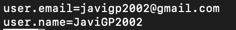

# Configuración de la GitHub
La configuración de la aplicación se realiza a través del *Version Control System* (VCS) de GitHub asociado con:
- Creación de claves privada y pública.
- Configuración de correo y nombre de usuario

