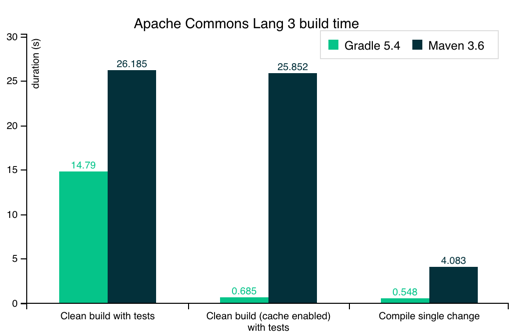

# Hito 2
Este hito tiene la lógica que hemos a creado desde 0. Asimismo, la intención del mismo
es saber crear test, elegir y configurar las diferentes herramientas para el framework debidamente 
así como la integración continua.

## Elección y configuración del gestor de tareas.
Un gestor de tareas dentro del proyecto es esencial, provee valores automatizando las tareas a
desarrollar dentro del mismo. Para elegir el mismo tendremos que elegir la opción más óptima 
dentro de nuestro entorno elegido así como aquella que realice de una manera sencilla todos los 
procesos que necesitemos para, por ejemplo, ejecutar linter (herramienta a cargo de la mejora 
del código para identificar fallos o problemas del sistema).

Dentro de los gestores de tareas que existen y están más popularizados en kotlin son:
### Maven
Maven es una herramienta de gestión de proyectos de software que se utiliza para la construcción 
y gestión de cualquier proyecto basado en Java. Maven utiliza un archivo XML llamado POM (Project Object Model) 
para describir el proyecto de software que se está construyendo, sus dependencias en otros módulos y componentes 
externos, y la manera en que se compila, empaqueta y despliega el software. 

### Gradle
Se realiza a través de un archivo de configuración bastante útil y sencillo de utilizar.
Gradle presenta una manera para extender las librerías, y dependencias e implementaciones de manera bastante
bursátil y flexible. Además, cuenta con una documentación bastante extensa y útil para el desarrollo de
proyectos, así como una comunidad bastante activa que puede ayudar en caso de problemas. La eficiencia del mismo
es bastante buena, y es bastante sencillo de utilizar. Asimismo, JetBrains (creadores de Kotlin e IntelliJ IDEA)
han creado un plugin para el mismo, lo que hace que sea bastante sencillo de utilizar en Kotlin.

###  Elección
La elección de Gradle es la más óptima para el proyecto, ya que es bastante sencillo de utilizar y cuenta con
una integración sobre el IDE utilizado bastante buena. Asimismo, la documentación del mismo es bastante extensa
y la eficiencia del mismo es bastante mejor sobre proyectos grandes. Podría ser el caso si se siguiera implementando
al finalizar la asignatura. En la siguiente figura mostraremos las diferencias.

## Elección y uso del marco de pruebas.
Actualmente, kotlin cuenta con una serie de frameworks de pruebas bastante útiles y sencillos de utilizar. Entre ellos y
debido a que estoy utilizando un proyecto con un lenguaje que estoy aprendiendo, he decidido decantarme por los dos más
populares y sencillos de utilizar en su integración con Kotlin. Estos son:

### Springboot
Springboot es un framework de pruebas bastante útil y sencillo de utilizar. Cuenta con una documentación bastante extensa
y una comunidad bastante activa que puede ayudar en caso de problemas. La integración con Kotlin es bastante buena y sencilla
de utilizar. Asimismo, cuenta con una serie de herramientas bastante útiles para el desarrollo de pruebas.

### Ktor
Ktor es un framework web de Kotlin creado por JetBrains que se utiliza para crear aplicaciones web y servicios web.
Además, es un marco web asíncrono y basado en eventos que se ejecuta en la JVM. Asimismo se encuentran ya en su versión
3.0.0, lo que hace que sea bastante estable y sencillo de utilizar. La documentación del mismo es bastante sencilla y 
se encuentra detallada en la página oficial del mismo. Por último, ktor es ligero y flexible.

### Elección
Aunque Springboot es una herramienta bastante útil y sencilla de utilizar, he decidido decantarme por Ktor, ya que es
una nueva herramienta que me suscita bastante curiosidad y me gustaría aprender a utilizarla. Asimismo, la documentación
del mismo es bastante extensa como se ha comentado previamente y la integración con Kotlin es total debido a que son los 
mismos desarrolladores. En definitiva, la decisión ha sido tomada por la curiosidad y las ganas de aprender algo nuevo.

## Elección y uso de la biblioteca de aserciones.

## Integración continua funcionando y correcta justificación del sistema elegido.

## Correcta implementación y ejecución de los tests para testear algunos aspectos de la lógica de negocio de la aplicación a desarrollar.
   