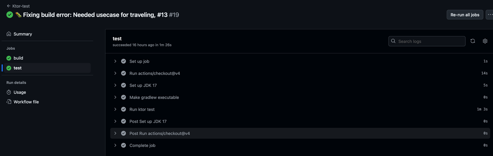
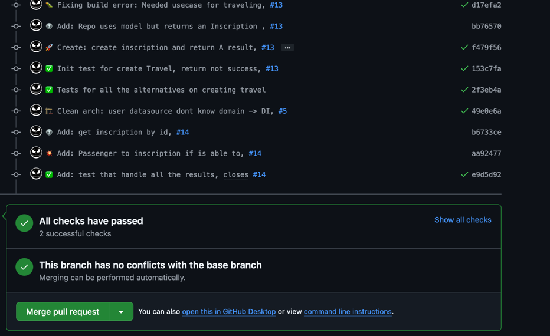
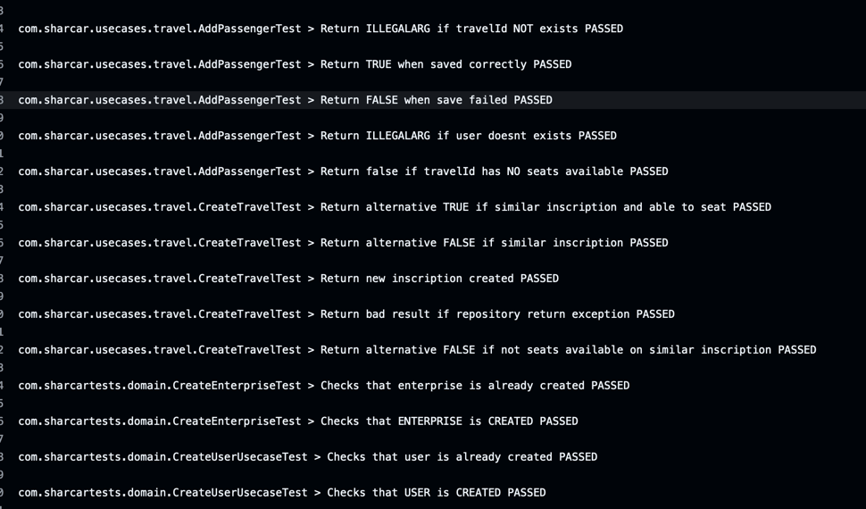

# Hito 2
Este hito tiene la lógica que hemos a creado desde 0. Asimismo, la intención del mismo
es saber crear test, elegir y configurar las diferentes herramientas para el framework debidamente 
así como la integración continua.

## Elección y configuración del gestor de tareas.
Un gestor de tareas dentro del proyecto es esencial, provee valores automatizando las tareas a
desarrollar dentro del mismo. Para elegir el mismo tendremos que elegir la opción más óptima 
dentro de nuestro entorno elegido así como aquella que realice de una manera sencilla todos los 
procesos que necesitemos para, por ejemplo, ejecutar linter (herramienta a cargo de la mejora 
del código para identificar fallos o problemas del sistema).

Dentro de los gestores de tareas que existen y están más popularizados en kotlin son:
### Maven
Maven es una herramienta de gestión de proyectos de software que se utiliza para la construcción 
y gestión de cualquier proyecto basado en Java. Maven utiliza un archivo XML llamado POM (Project Object Model) 
para describir el proyecto de software que se está construyendo, sus dependencias en otros módulos y componentes 
externos, y la manera en que se compila, empaqueta y despliega el software. 

### Gradle
Se realiza a través de un archivo de configuración bastante útil y sencillo de utilizar.
Gradle presenta una manera para extender las librerías, y dependencias e implementaciones de manera bastante
bursátil y flexible. Además, cuenta con una documentación bastante extensa y útil para el desarrollo de
proyectos, así como una comunidad bastante activa que puede ayudar en caso de problemas. La eficiencia del mismo
es bastante buena, y es bastante sencillo de utilizar. Asimismo, JetBrains (creadores de Kotlin e IntelliJ IDEA)
han creado un plugin para el mismo, lo que hace que sea bastante sencillo de utilizar en Kotlin.

###  Elección
La elección de Gradle es la más óptima para el proyecto, ya que es bastante sencillo de utilizar y cuenta con
una integración sobre el IDE utilizado bastante buena. Asimismo, la documentación del mismo es bastante extensa
y la eficiencia del mismo es bastante mejor sobre proyectos grandes. Podría ser el caso si se siguiera implementando
al finalizar la asignatura. En la siguiente figura mostraremos las diferencias.


## Elección y uso del marco de pruebas.
Actualmente, kotlin cuenta con una serie de frameworks de pruebas bastante útiles y sencillos de utilizar. Entre ellos y
debido a que estoy utilizando un proyecto con un lenguaje que estoy aprendiendo, he decidido decantarme por los dos más
populares y sencillos de utilizar en su integración con Kotlin. Estos son:

### Springboot
Springboot es un framework de pruebas bastante útil y sencillo de utilizar. Cuenta con una documentación bastante extensa
y una comunidad bastante activa que puede ayudar en caso de problemas. La integración con Kotlin es bastante buena y sencilla
de utilizar. Asimismo, cuenta con una serie de herramientas bastante útiles para el desarrollo de pruebas.

### Ktor
Ktor es un framework web de Kotlin creado por JetBrains que se utiliza para crear aplicaciones web y servicios web.
Además, es un marco web asíncrono y basado en eventos que se ejecuta en la JVM. Asimismo se encuentran ya en su versión
3.0.0, lo que hace que sea bastante estable y sencillo de utilizar. La documentación del mismo es bastante sencilla y 
se encuentra detallada en la página oficial del mismo. Por último, ktor es ligero y flexible.

### Elección
Aunque Springboot es una herramienta bastante útil y sencilla de utilizar, he decidido decantarme por Ktor, ya que es
una nueva herramienta que me suscita bastante curiosidad y me gustaría aprender a utilizarla. Asimismo, la documentación
del mismo es bastante extensa como se ha comentado previamente y la integración con Kotlin es total debido a que son los 
mismos desarrolladores. En definitiva, la decisión ha sido tomada por la curiosidad y las ganas de aprender algo nuevo.

## Elección y uso de la biblioteca de aserciones.
La biblioteca de aserciones dentro del marco de ktor con kotlin y gradle se divide principalmente en la necesidad de una 
libreria útil y fléxible que funcione bien dentro de nuestro framework para que sea también fácil de testear
y utilizar en la integración continua. Las bibliotecas más populares y sencillas de utilizar en kotlin son:

### JUnit
JUnit es un marco de pruebas unitarias para el lenguaje de programación Java integrado para ktor de manera nativa. 
Por otro lado, cuenta con una documentación básica y facilidades para crear pruebas unitarias con funciones de aserción
para todo tipo de pruebas (BeforeTest, AfterTest...). Este no requiere de una configuración adicional para su uso.

### Spek
Ecosistema de pruebas para Kotlin. Spek es una biblioteca de pruebas de especificación para Kotlin que se basa en el
marco de pruebas JUnit. Es básicamente una biblioteca que permite escribir pruebas en un estilo de especificación más
fácil para leer para el humano.

### Kotest
Kotest es una biblioteca de pruebas para Kotlin que se cuenta con más de 300 aserciones y una documentación extensa para
poder entender y utilizar la misma.

### Elección
La verdad es que kotlin con JUnit está muy bien integrado y es fácil de utilizar. Debido a que estamos empezando un proyecto
y no queremos que se compliquen los archivos de configuración básicos, he decidido escoger JUnit por las 
facilidades de integración y documentación que encontramos asociados a la propia página de ktor.

## Integración continua funcionando y correcta justificación del sistema elegido.

Tener una integración continua es esencial para el desarrollo de un proyecto. Nos permite tener una serie de pruebas
automáticas que se ejecutan cada vez que se realiza un cambio en el código. Para ello, Github nos permite diferentes
sistemas para la integración continua a ejecutar según cuando se requiera.

Para ello, tenemos que saber como poder ejecutar nuestros tests de forma local mediante un comando que será el que
ejecute
periodicamente nuestro sistema de integración continua. En nuestro caso, ktor con kotlin en gradle (mencionado
anteriormente)
permite ejecutar los mismos a través del shell que se genera en `./gradlew` que tiene unos comandos básicos para
ejecutar

```shell
./gradlew assemble # Build
./gradlew test
```

Una vez que conocemos esto, hay que elegir el sistema:

### Circle CI

Permite fácil integración entre **GitHub**, existen tutoriales para poder trabajar y construir pipelines
sobre proyectos **Ktor**, se puede ejecutar imágenes **docker** para iniciar un contenedor y es **gratuito**
Además, contiene fácil integración y la úlltima actualización fue en noviembre de 2024 (v4.7.0).

### GitHub Actions

Permite una gran integración para las pruebas que se configura de manera muy sencilla
a través de un `.yml`. Asimismo, es **gratuito** y se puede ejecutar en cualquier sistema operativo y java.

### Elección

**Github Actions** es la mejor elección para nuestro trabajo de la asignatura debido a la
versatilidad y facilidad de uso que nos ofrece. La integración es muy rápida y los recursos son muchos.
Por otro lado, este sistema ya es conocido por el desarrollador lo que lo hace mucho más sencillo.

### YML

[YML](../../../.github/workflows/ci.yml) es un archivo de configuración. En este caso, se ha creado en un entorno de
**ubuntu latest** aunque también se podría haber implementado con **alpine**. En este archivo,
le vamos a permitir a gradlew ser ejecutado para, después realizar el `assemble` para comprobar que se realiza
correctamente. Seguidamente, se ejecutarán los tests a través de `./gradlew test`. Todo esto se ha realizado
usando el JDK 17 de Java de la versión de Oracle.

### Ejecución

A continuación, mostramos cómo se ejecutan los tests y la comprobación correcta de los mismos. Estos se realizan en cada
push que se realiza en el repositorio.



Esto nos permite guiarnos sobre cada vez que se sube al repositorio datos y,
poder añadirlos correctamente a la main sin problemas.



## Correcta implementación y ejecución de los tests para testear algunos aspectos de la lógica de negocio de la aplicación a desarrollar.

- [x] Los test que se comprueban son unitarios, es decir, comprueban una lógica de negocio concreta.
- [x] Los test utilizan `Mockito` para mockear toda aquella función que no se esté testeando realmente.
- [x] Las funciones no testeadas son las que nosotros debemos controlar la entrada y salida. Comprobar si una variable
  se mete en un array
  no debe ser testeado, sino la interacción de la misma.
- [x] Los test deben ser independientes entre sí, es decir, no deben depender de otros test para poder ejecutarse.
- [ ] No se ha testeado todo el código aunque está en una arquitecura para hacerlo fácilmente
- [x] Se ha implementado una `Clean Architecture` para discernir mejor la idea de **lógica de negocio**
  