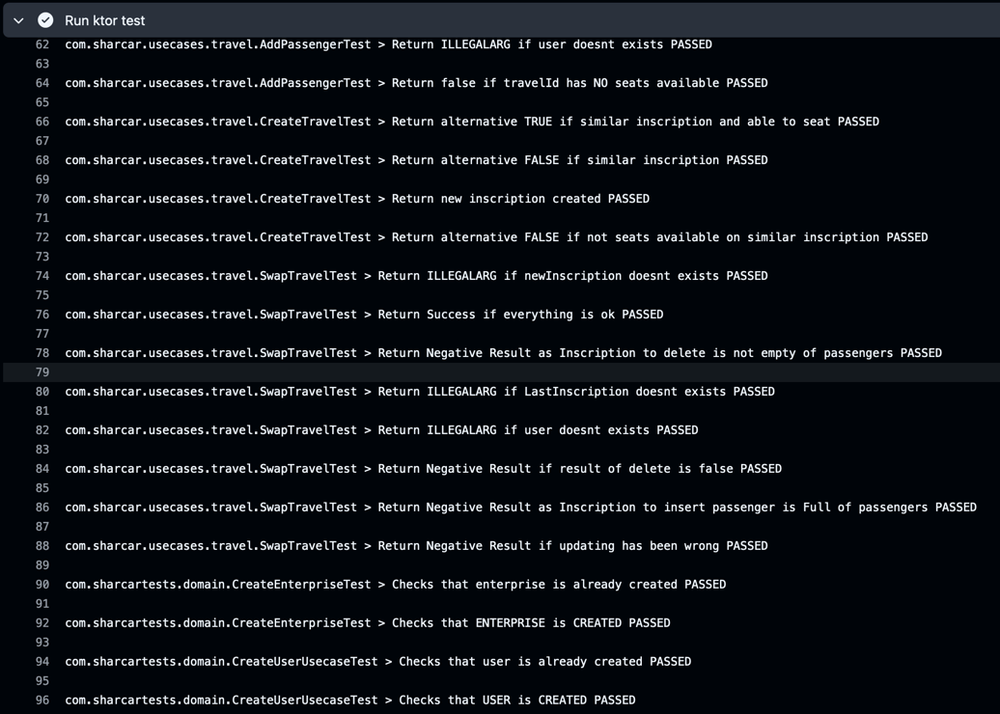

# Hito 3

## Justificación Framework Elegido

Actualmente, kotlin cuenta con una serie de frameworks de pruebas bastante útiles y sencillos de utilizar. Entre ellos y
debido a que estoy utilizando un proyecto con un lenguaje que estoy aprendiendo, he decidido decantarme por los dos más
populares y sencillos de utilizar en su integración con Kotlin. Estos son:

### Springboot

Springboot es un framework de pruebas bastante útil y sencillo de utilizar. Cuenta con una documentación bastante
extensa
y una comunidad bastante activa que puede ayudar en caso de problemas. La integración con Kotlin es bastante buena y
sencilla
de utilizar. Asimismo, cuenta con una serie de herramientas bastante útiles para el desarrollo de pruebas.

### Ktor

Ktor es un framework web de Kotlin creado por JetBrains que se utiliza para crear aplicaciones web y servicios web.
Además, es un marco web asíncrono y basado en eventos que se ejecuta en la JVM. Asimismo se encuentran ya en su versión
3.0.0, lo que hace que sea bastante estable y sencillo de utilizar. La documentación del mismo es bastante sencilla y
se encuentra detallada en la página oficial del mismo. Por último, ktor es ligero y flexible.

### Elección

Aunque Springboot es una herramienta bastante útil y sencilla de utilizar, he decidido decantarme por Ktor, ya que es
una nueva herramienta que me suscita bastante curiosidad y me gustaría aprender a utilizarla. Asimismo, la documentación
del mismo es bastante extensa como se ha comentado previamente y la integración con Kotlin es total debido a que son los
mismos desarrolladores. En definitiva, la decisión ha sido tomada por la curiosidad y las ganas de aprender algo nuevo.

## Elección de librería de logs y registro de estos

Ktor como venimos comentando es relativamente nuevo, por ello la elección de la librería de logs consiste en dos
opciones:

## Klogging

Se encuentran actualmente en la version 0.8.0 y es capaz de poder funcionar de manera asíncrona teniendo una
configuración sencilla a través de DSL o un json. Su principal tarea es poder crear una buena experiencia a los
desarrolladores de C# y Java con unos logs estructurados. Sin embrgo, aún está a unos comienzos y no es una librería que
pueda contar con una comunidad activa debido a su reciente creación y esto puede ser un problema de cara a enfrentarnos
a problemas futuros.

## SLF4J API

Es la versión nativa de Ktor que actua como fachada de varios frameworks de logs como **Logback** o **Log4j**. Es una
librería bastante estable donde en el archivo de configuración xml se elige, por ejemplo, el destino de los logs y
permite
una fácil integración dentro de nuestro framework. Dentro de esta versión debemos decidir los dos frameworks comentados:

### Logback

Es el sucesor directo de Log4j creado por Ceki Gülcü y está diseñado para ser más rápido,
flexible y eficiente.
Su integración es bastante sencilla y cuenta con bastante documentación y comunidad entre los desarrolladores java.
Para añadirlo hay que:
`implementation("ch.qos.logback:logback-classic:$logback_version")`

### Log4j

Log4j es una biblioteca de registros más antigua que sigue desarrollándose y con, quizás más documentación pero
una comunidad menos activa. Su integración es bastante sencilla y su integración requiere unos pocos más de cambios
en el archivo de configuración. Para añadirlo hay que "o use Log4j, you need to add the org.apache.logging.log4j:
log4j-core
and org.apache.logging.log4j:log4j-slf4j-impl artifacts."

## Elección

La elección por comodidad, comunidad y documentación en un cómputo global es de **SLF4J API** con **Logback**. Aunque
Klogging es una librería bastante interesante y con un futuro prometedor. Por otro lado log4j es una librería
interesante
pero me gusta probar una implementación más nueva y donde se haya apostado por la flexibilidad y rapidez.

## Diseño de la API, test y documentación

Los test de la API ya están siendo ejecutados en cada uno de los commits que se realizan. Asimismo, como se ha
especificado
en otros hitos, nostors estamos aplicando una _clean architecture_ (mientras se aprende a realizarla correctamente con
los
fallos oportunos) donde aplicamos el _single responsability_ y la división por capas. Cómo podemos ver en el código
la api ejecuta unos casos de uso, que tienen sus propios tests, y nosotros vemos si la api responde bien y con los
resultados
esperados.

Por otro lado, ahora mismo no se ha entrado mucho en el funcionamiento integro de la api debido a que la siguiente parte
se va a basar en tener ya una base de datos con los que poder trabajar realmente. Esto afectará a la capa de datasource
que,
gracias al patrón de diseño _repository_ podemos gestionar de manera sencilla aunque pueda llegar a afectar si se decide
cambiar o ampliar algún campo de la base de datos, modificando así la capa de dominio.

Actualmente, cada capa que depende de un servicio externo (como la capa de datasource) recibe un DTO que al fin y al
cabo
suele ser un JSON con strings o ints que luego trasnformamos. Esto lo hacemos así para poder agregar a la capa de
dominio
un modelo sólido donde no se tengan que comprobar datos como si realmente un "email" tiene el patrón que debería, esto
será
gestionado por el propio DTO.

Los cambios que se realizan gradualmente afectan a hitos anteriores debido a que no se ha hecho un procedimiento
demasiado
exhaustivo para poder saber y coordinar tanto los datos que queremos guardar y los que se van a enviar al front.

Los test nuevos se pueden ver como se ejecutan correctamente:

## Correcto funcionamiento de logs

Se ha subido el [logger](../../../logFile.log) que ha ido saliendo a través de la realización del milestone. Sin
embargo, como
se puede apreciar
no solo tenemos los que hemos puesto nosotros que están en dos puntos fundamentales:

- **Status de la aplicación**: donde KTOR maneja las excepciones y, por tanto, podemos guardar la excepción tal cual
  ocurrió
  mientras que podemos informar al front de que ha ocurrido un error sin especificar si no queremos el porqué.
- **API**: Mostramos a grandes rasgos que se está ejecutando de manera que podremos saber si hay algún error donde
  empezó.

