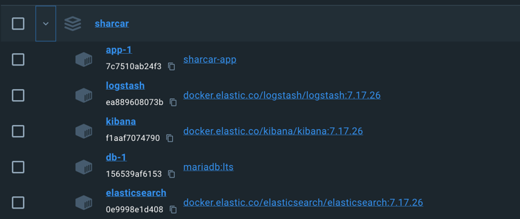

# Hito 4

# Clúster de contenedores

El cluster de contenedores tal y cómo está representado en el fichero `compose.yaml` está compuesto por 3 partes
fundamentales:

* Ktor: backend
* MariaDB: base de datos
* ELK: Logger

Esta composición se puede determinar como una arquitectura de microservicios, donde cada uno de los servicios se encarga
de una parte de la aplicación.
En ella la lógica principal de la aplicación se resuelve a partir de ktor que va registrando y llamando a los demás
servicios
para emplear el uso que convenga como puede ser la recolección de datos almacenados en la base de datos .

En esta imagen comprobamos como se conecntan los microservicios los cuales tienen asignados su propio contenedor. ESto
los hace
resilientes a probelmas relacionados con otros contenedores de manera que podemos escalarlos de manera independiente.En
_docker desktop_
podemos ver como se conectan están siendo ejecutados estos contenedores.

Para la conexión de la base de datos se ha utilizado _hikari_ que nos permite realizar un pool de conexiones a una base
de datos
dada su url, cómo hemos creado una red conjunta en el compose.yaml, podemos acceder a la base de datos a través de la
url `jdbc:mariadb://db:3306/sharcar`
donde `db` es el nombre del contenedor de la base de datos.

Asimismo, para poder enviar los datos al logback, convertimos cada log en un json que logback es capaz de enviar a
elasticsearch y kibana
para su posterior análisis. Esto se ha añadido con el _appender_ en el
fichero [logback.xml](../../../src/main/resources/logback.xml) que envía la información al mismo.

# documentación y justificación de la configuración de cada uno de los contenedores que componen el clúster de contenedores, incluyendo en cada caso la justificación del contenedor base.

Los contenedores lo vamos a ir dividiendo por sus partes:

## Ktor

En primer lugar lo que estamos haciendo es explicar de donde tiene que sacar la información el contenedor,
para ello utilizará un dockerfile que se explicará más adelante.
En segundo lugar, se le asigna un puerto para que pueda ser accedido desde el exterior, en este caso el 8080.
Seguidamente, establecemos las dependencias fundamentales para la ejecución del mismo que son:

* La base de datos: como _servicehealthy_de manera que sabemos que ya está inicializada, para que no exista ningún
  momento que pueda fallar.
* Logstash: como _service started_ para comprobar que se ha empezado a inicializar previamente.

Asimismo, añadimos una red conjunta donde se van a interconectar los contenedores y, por último, establecemos una
conexión explicita con los otros contenedores
y el controlador implementado para el loggin con opcciones secundarias como el tamaño máximo del log o el máximo de
archivos que se guardarán.

## MariaDB

Establecemos la imagen principal de la que se compone, implementando mariadb:lts debido a que es una
imagen bastante simple que viene integrada por defecto con las necesidades que debemos complacer, aunque también
podriamos haber
utilizado una imagen alpine. Los puertos utilizados, volumenes donde se guardara la información, red y datos sensibles
(deberían ir en un entorno de variables para no mostrarlos directamente).

El healthcheck permite comprobar que la base de datos está funcionando correctamente, en caso de que no lo esté, se
reiniciará el contenedor y,
si todo es correcto, entonces ktor se podrá inicializar.

## ELK

Este sistema de logs ampliamente utilizado para todo tipo de métricas y opciones para poder tener una visualización de
los logs de manera sencilla,
flexible y centralizada. La red es la misma y los distintos puertos abiertos para utilizar las distintas herramientas
que nos ofrece.
Asimismo, la configuración de logstash para poder enviar los logs al mismo viene determianda por el
fichero [logstash.conf](../../../logstash.conf) que se encuentra en la carpeta raíz del proyecto.

Vemos como todo funciona correctamente en ejecución cuando queremos comprobar los logs que se ven por la web que se
crea.

Las imágenes base de los contenedores podrían ser personalizados pero por eficiencia y efectividad, se han empleados
aquellos que
aparecen por docker desktop como recomendados cómo es el caso de MariaDb sobre Ubunto:lts. Asimismo, esto no afecta al
rendimiento
de la palicación sino que hay que estar alerta para poder tener en cuenta, sobretodo, los problemas de seguridad que se
puedan dar.
Los otros contenedores han sido seguidos por sus versiones
lts [7.17.26](https://www.elastic.co/guide/en/elasticsearch/reference/7.17/es-release-notes.html) la cual
es la última de la versión 7 y ofrece gran información al respecto.

# Dockerfile del contenedor con la lógica de la aplicación.

El [dockerfile](../../../Dockerfile) del contenedor de ktor viene dada por la propia documentación de ktor, actualizada
el 19 de septiembre de
2024 . En esta se determina cómo crear la aplicación y el proyecto para una imagen de docker.

1. Estamos creadndo el proyecto y descargando las dependencias siempre que haya un cambio en la construción de los
   archivos relacionados (Si este no se utiliza o las dependencias no son cacheadas en las demás etapas, las
   dependencias)
   se descargarán en cada _build_)
2. Se construye el JAR de la aplicación por defecto de manera que trabajamos sobre la app de ktor.
3. Creamos una imagen sobre amazoncorretto:22 para poder ejecutar la aplicacion y el jar en el puerto 8080 mientras se
   copia toda la app a la carpeta y se ejecuta
   el JAR.

# GitHub Packages y documentación de la actualización automática

Para la creación y actualización de nuestar imagen en GithubPackages nos hemos basado en la propia documentación oficial
de Github
donde este nos va a crear la imagen en ghrc.io y nos va a permitir la actualización automática de la misma. Asimismo,
sube la aplicación
a la rama principal con su tag y a docker hub para poder ser descargada por cualquier usuario.

Para ello, el archivo de integración continua nos va a crear un token automáticamente y subirá la imagen de docke con el
tag y las credenciales
que aparece en el metadata de la aplicación. Cómo tenemos conectados ambos servicios, se nos genera un token unitario y
automático que no hay que
gestionar por si solo con secrets. Finalmente, podemos ver que esto se ejecuta de manera correcta a través del commit.

Estos cambios serán gestionados únicamente para actualizarse solo durante los _push_ sobre la rama principal debido
al consumo de recursos que supone la actualización de la imagen e innecesarios con cambios minoritarios.
Se puede ver [aquí](https://github.com/javigp2002/Sharcar/pkgs/container/sharcar)

# Test para validar el funcionamiento del cúster de contenedores.

Para validar el test de contenedores hay que comprobar que cuando se ejecuta el docker compose y se termina del mismo,
somos capaces de hacer una llamada
a este y comprobar que los contenedores se escuchan entre sí y están conectados. Para ello, se ha comprobado el estado
de la base de datos con un test
muy simple pero efectivo. Cuando se ejecuta el test se envía un `select 1+1 ` de tal manera que si todo funciona
correctamente este deberá responder
satisfactoriamente y, por tanto, devolver a través del _entrypoint_ destinado a ello, que está correcta la base de
datos.

Este es un test de integración bastante sencillo pero que cumple a la perfección lo requerido para este hito. La
ejecución del mismo sería:

`docker compose up -d && ./gradlew :test --tests "com.integration.*"`

Donde se llamaríana todos los tes de integración necesarios para ser realizados una vez el sistema está en marcha.

