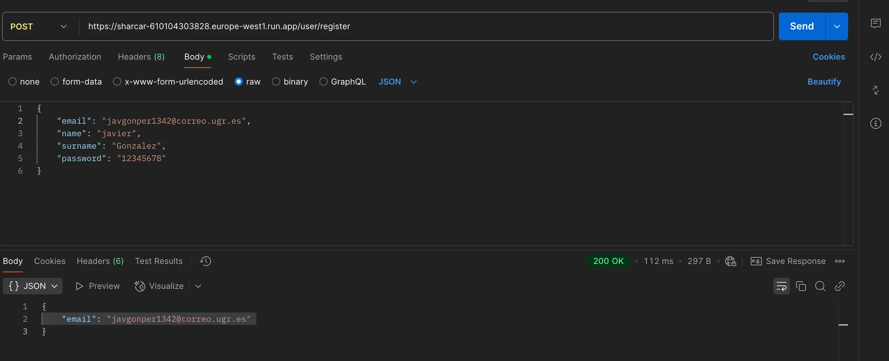

# Hito 5

# Descripción y justificación de los criterios usados para elegir el PaaS y las diferentes opciones valoradas. En el caso que haya sido necesario seleccionar un IaaS, justifique también su decisión.

Se han ido probando numerosos PaaS y se han ido estudiando los siguientes criterios.

Los criterios para el uso de estos servicios son los siguientes:

* **Facilidad de uso**: Se ha buscado un servicio que sea fácil de usar y que permita desplegar aplicaciones de forma
  sencilla.
* **Documentación**: Se ha valorado la documentación de los servicios, para poder encontrar ayuda en caso de problemas.
* **Precio**: Se ha valorado el precio de los servicios, buscando un servicio que sea gratuito o algún periodo de
  pruebas sin tarjeta de crédito.
* **Soporte de lenguajes**: Se ha valorado que el servicio soporte los lenguajes de programación que se van a utilizar.

## Opciones evaluadas:

* **Heroku**: Es un servicio PaaS que soporta varios lenguajes de programación. Tiene un plan gratuito que permite
  desplegar aplicaciones de forma sencilla. La documentación es muy buena y tiene una gran comunidad de usuarios.
  Sin embargo, el plan gratuito necesita de una tarjeta de crédito para poder ser utilizado.
* **Google App Engine**: Es un servicio PaaS de Google que soporta varios lenguajes de programación. Tiene un plan
  gratuito que permite desplegar aplicaciones de forma sencilla. La documentación es muy buena y tiene una gran
  comunidad de usuarios.
  y, aunque necesita tarjeta de crédito, tiene un plan gratuito que te va avisando de lo que estás gastando y te avisan
  de que no habrá coste pasado el límite sin previo aviso.
* **Microsoft Azure**: Es un servicio PaaS de Microsoft que soporta varios lenguajes de programación. Tiene un plan
  gratuito que
  pero te pide una tarjeta de crédito así como una verificación que pide una verificación previa por su parte de 3-5
  días.
* **AWS Elastic Beanstalk**: Es un servicio PaaS de Amazon que soporta varios lenguajes de programación. Tiene un plan
  gratuito que
  pero te pide una tarjeta de crédito así como una verificación que pide una verificación previa por su parte de 2-4
  días.
* **Render**: Este se descarto pronto debido a que no puede desplegar aplicaciones en Java.
* **Scalingo**: Ha sido el primero que encontré, pero su plan gratuito, aunque no pide tarjeta, tiene numerosas
  dificultades para la creación de la base de datos y poca documentación a mi parecer.

## Decisión

Se ha decidido usar **Google App Engine** debido a que es el cumple la mayor parte de los criterios destacados.
No obstante, hay que recalcar que como nuestro proyecto debe de ser desplegado junto a una base de datos para poder
funcionar correctamente,
esto se ha hecho bastante complicado en Google App Engine debido a que no podemos establecer varios contenedores del
mismo github con la base actual
que salió del **Hito 4**.

# Descripción y justificación de las herramientas usadas para desplegar la aplicación en el PaaS y configuración de github.

Para el despliegue de la aplicación se ha tenido que implementar, a parte, un PaaS convertido desde IaaS a través
de **Google Engine** para la base de datos y luego un PaaS normal a través de **Google Run**. Para ello, hemos tenido
que crear una
máquina virtual que nos cuesta 27 dólares al mes y se encuentra alojado en **Europa del este (Bélgica)**. Una vez
establecido esto:


Ahora que creamos la máquina que alojará la base de datos, vamos a hacer los siguiente pasos:

1. Añadimos docker a la máquina virtual.
   `     sudo apt-get update
   sudo apt-get install -y docker.io
   sudo systemctl start docker
   sudo systemctl enable docker
   `
2. Activar entradas y salidas del firewall para permitir el acceso
3. Subimos los archivos que se han generado en el commit: daf1d18fcd0064fc87b3d4065c21fb56d3459432
4. Creamos la imagen de la base de datos.
   `     docker build -t sharcardb .
   `
5. Creamos el contenedor de la base de datos.
   `     docker run -d -p 3306:3306 sharcardb sharcardb
   `
6. Comprobamos que la base de datos está funcionando.
   `     docker ps
   `
7. Establecemos una ip estática que permitirá el acceso a la base de datos desde la aplicación.
   
   

Una vez realizado esto nos vamos a Google Run y creamos un nuevo servicio, seleccionamos la imagen que hemos creado y le
damos a desplegar:


Cuando demos a crear instancia, entonces tendremos la url de la aplicación con la que podremos testear el despliegue de
la misma y que está asociada
al repositorio y haciendo peticiones a la base de datos que hemos creado previamente.

## Creación por comandos

Aunque la web es bastante sencilla y permite un despliegue rápido, también se puede hacer por comandos. Para ello, se ha
creado un script que automatiza
el despliegue de la aplicación. Para ello, se ha creado el siguiente script:

```bash
gcloud components install app-engine-java
gcloud projects create ktor-sample-app-engine --set-as-default
gcloud app create
./gradlew appengineDeploy
```

Para ello, también habría que cambiar partes del código que se encuentran en
esta [url](https://ktor.io/docs/google-app-engine.html#prepare-app)

# Pruebas de funcionamiento

Para las pruebas de funcionamiento se ha utilizado **PostMan**, en el haremos las principales peticiones a nuestro
servidor alojado
en **Google Run**. Para ello, hemos hecho las siguientes peticiones:

1. https://sharcar-610104303828.europe-west1.run.app/travel/swapTravel
   
2. https://sharcar-610104303828.europe-west1.run.app/user/register
   
3. https://sharcar-610104303828.europe-west1.run.app/travel/create
   